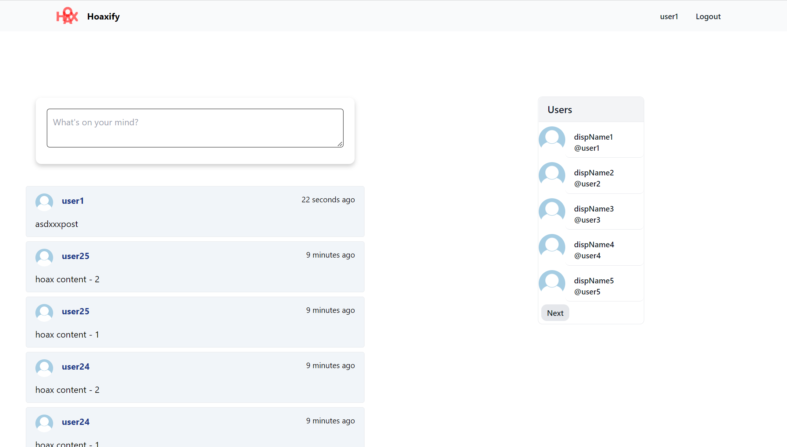
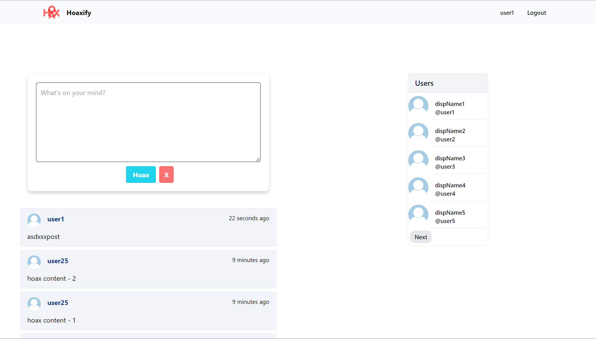
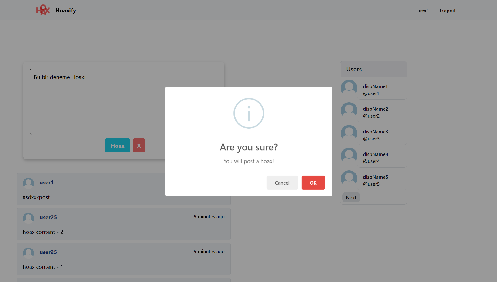
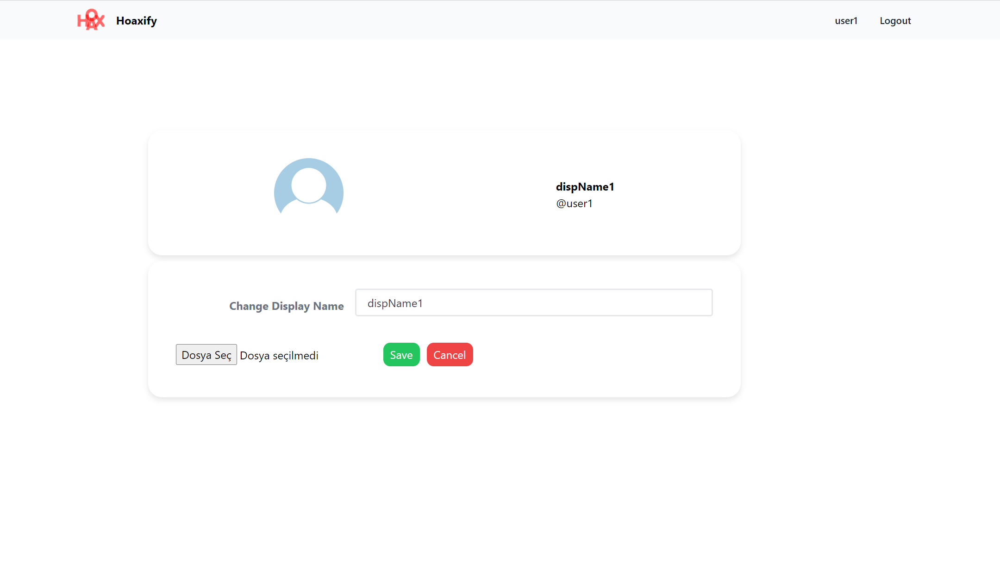
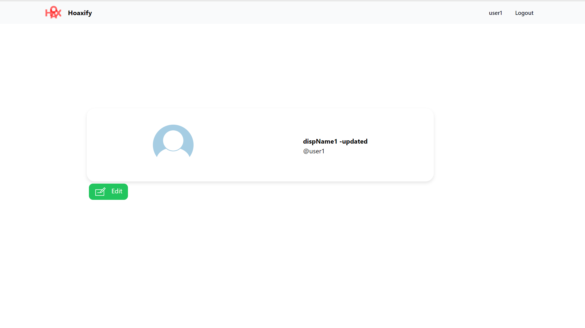
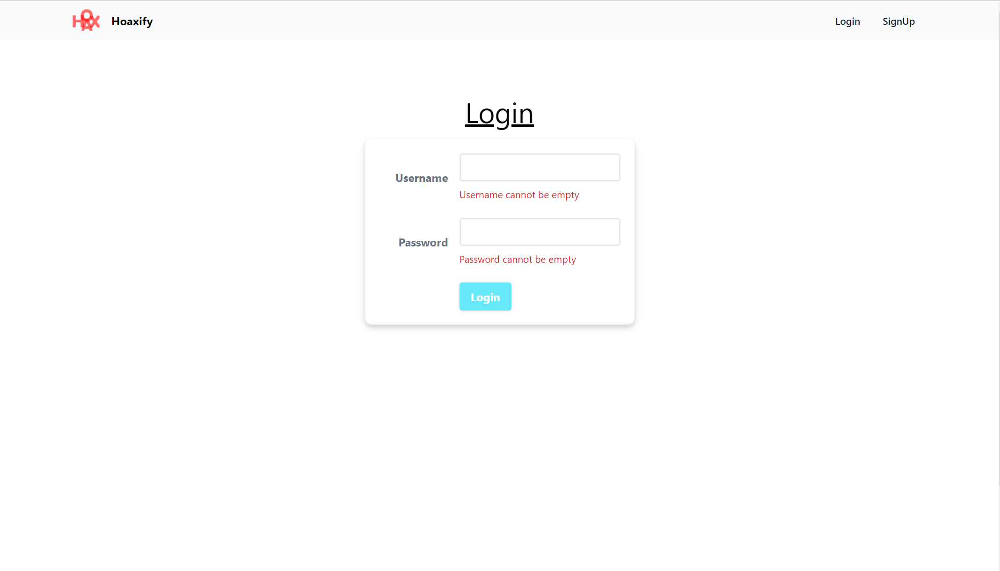
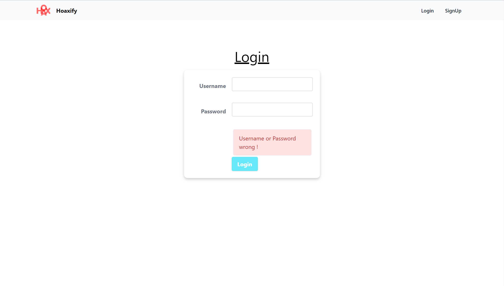
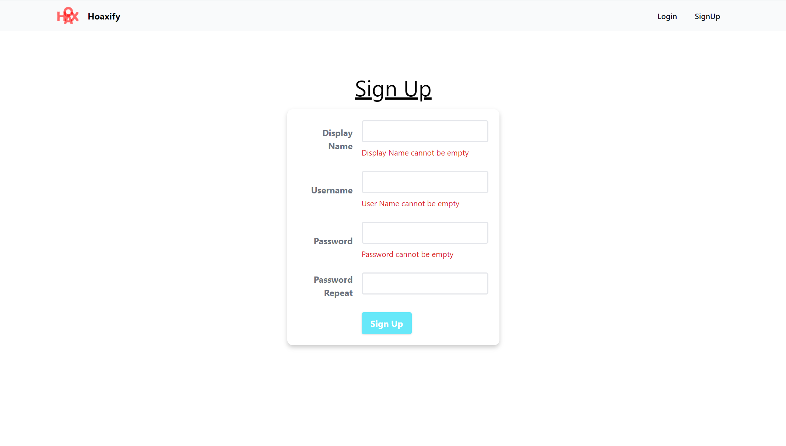
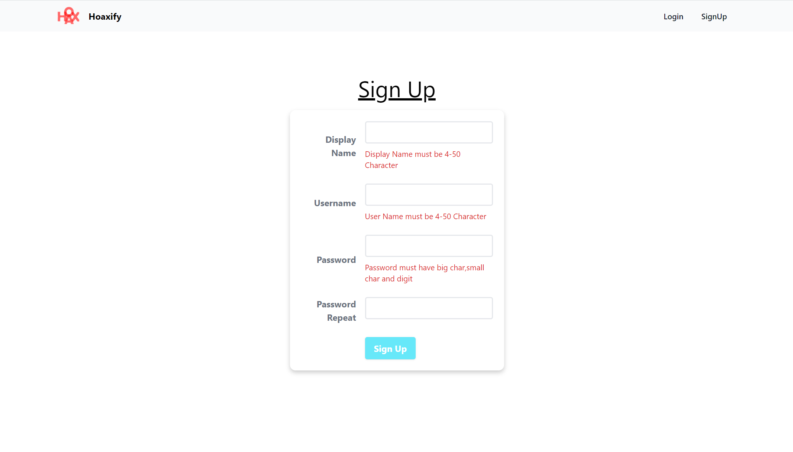
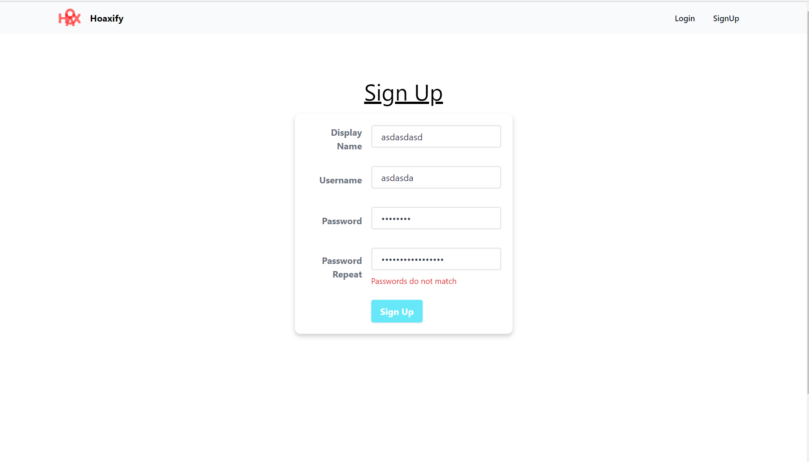

# Hoaxify App
Hoaxify is a social media app that allows users to share hoaxes. It is a full-stack application that uses Spring Boot for the backend and React for the frontend. It is a project that I created while learning Spring Boot and React. It is a work in progress and I will be adding more features to it in the future.

## Features
- User registration
- User login
- User logout
- User profile
- User List with pagination
- User profile image upload
- Hoax submission
- Hoax List with load more 

## Technologies
- React
- React Router
- Tailwind CSS
- Axios
- Jest
- Webpack
- ESLint

## Screenshots

### Home Page

<strong> Home page , user logged in , textarea not focused</strong>

<strong> Home page , user logged in , textarea focused</strong>

<strong> Home page , user logged in , Hoax submit alert</strong>

### User Profile Page

<strong> User Profile page , if logged in can edit </strong>

<strong> User Profile page , if logged in can edit</strong>

### Login Page

<strong> Not-null Validation</strong>

<strong> Wrong password or username notation</strong>

### Signup Page

<strong> Not-null Validation</strong>

<strong> Registration Validation</strong>

<strong> Password Match Validation </strong>

